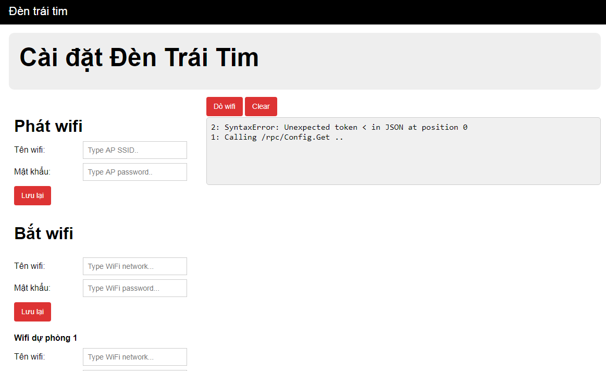

# Den Trai Tim 2
Đèn Trái Tim powered by Mongoose OS

# How to build
`mos build --platform esp8266`

# How to flash
`mos flash --platform esp8266 --esp-flash-params "dio,32m,80m" --port COM8 --esp-baud-rate 0 --esp-erase-chip --esp-rom-baud-rate 115200`
-  replace COM8 by your port,..

# License
- MIT license

# Preview

- UI:

- Demo

